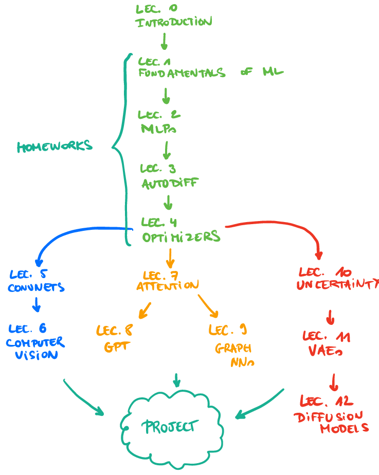

class: middle, center, title-slide

# Deep Learning

Lecture 0: Introduction

  
Prof. Gilles Louppe 
[g.louppe@uliege.be](mailto:g.louppe@uliege.be)

---

# Today

- Course outline
- Introduction to deep learning
- Fundamentals of machine learning

---

# Outline

- Lecture 0: Introduction
- Lecture 1: Fundamentals of machine learning
- Lecture 2: Multi-layer perceptron
- Lecture 3: Automatic differentiation
- Lecture 4: Training neural networks
- Lecture 5: Convolutional neural networks
- Lecture 6: Computer vision
- Lecture 7: Recurrent neural networks
- Lecture 8: Attention and transformer networks
- Lecture 9: Generative models (Part 1)
- Lecture 10: Generative models (Part 2)
- Lecture 11: Uncertainty
- Lecture 12: Deep reinforcement learning

---

class: middle

.center.width-60[]

---

class: middle

## My mission

By the end of this course, you will have acquired a solid and detailed understanding of the field of deep learning. 

You will have learned how to use and architecture deep neural networks for a wide range of advanced probabilistic inference tasks, including supervised learning on high-dimensional and structured data, unsupervised representation learning, or conditional data generation. 

These techniques apply to a wide variety of artificial intelligence problems, with plenty of applications in engineering and science.

---

class: middle

# Why learning?

---

class: middle, center

.width-100[]

What do you see?

???

.italic[How do you do that?]

---

class: middle

.center[
.width-70[]

Sheepdog or mop?
]

.footnote[Credits: [Karen Zack](https://twitter.com/teenybiscuit), 2016.]

---

class: middle

.center[
.width-70[]

Chihuahua or muffin?
]

.footnote[Credits: [Karen Zack](https://twitter.com/teenybiscuit). 2016.]

---

class: middle

The (human) brain is so good at interpreting visual information that the **gap** between raw
data and its semantic interpretation is difficult to assess intuitively:

 
.center[

This is a mushroom.
]

---

class: middle, center

.width-70[]

This is a mushroom.

---

class: middle, center

.width-30[] +
.width-30[] +
.width-30[]

This is a mushroom.

---

class: middle, center

.width-80[]

This is a mushroom.

---

class: middle, center

Writing a computer program that sees?

---

class: middle

.center.width-60[]

---

count: false
class: black-slide

.center.width-60[]

---

count: false
class: black-slide, middle

.center.width-80[]

---

count: false
class: black-slide, middle

.center.width-80[]

---

class: middle

Extracting semantic information requires models of **high complexity**, which cannot be designed by hand.

However, one can write a program that *learns* the task of extracting semantic information.

---

class: middle, black-slide

.center.width-70[]

The common approach used in practice consists of:
- defining a parametric model with high capacity,
- optimizing its parameters, by "making it work" on the training data.

---

class: middle

## A change of paradigm

We used to program computers. We will now train them.

---

class: middle

# Applications and successes

---

class: middle, center, black-slide

<iframe width="600" height="450" src="https://www.youtube.com/embed/5kpsZoKjPgQ" frameborder="0" allowfullscreen></iframe>

Object detection, pose estimation, segmentation (2019)

---

class: middle, center, black-slide

<iframe width="600" height="450" src="https://www.youtube.com/embed/V1eYniJ0Rnk" frameborder="0" allowfullscreen></iframe>

Reinforcement learning (Mnih et al, 2014)

---

class: middle, center, black-slide

<iframe width="600" height="450" src="https://www.youtube.com/embed/HcZ48JDamyk" frameborder="0" allowfullscreen></iframe>

Strategy games (Deepmind, 2016-2018)

---

class: middle, center, black-slide

<iframe width="600" height="450" src="https://www.youtube.com/embed/qhUvQiKec2U" frameborder="0" allowfullscreen></iframe>

Autonomous cars (NVIDIA, 2016)

---

class: middle, center, black-slide

<iframe width="600" height="450" src="https://www.youtube.com/embed/tlThdr3O5Qo" frameborder="0" allowfullscreen></iframe>

Autopilot (Tesla, 2019)

???

A full build of Autopilot neural networks involves 48 networks that take 70,000 GPU hours to train 🔥. Together, they output 1,000 distinct tensors (predictions) at each timestep.

---

class: middle, center, black-slide

<iframe width="600" height="450" src="https://www.youtube.com/embed/7gh6_U7Nfjs" frameborder="0" allowfullscreen></iframe>

Speech synthesis and question answering (Google, 2018)

---

class: middle, black-slide

.center[
<video loop controls preload="auto" height="400" width="600">
  <source src="./figures/lec7/physics-simulation.mp4" type="video/mp4">
</video>

Physics simulation (Sanchez-Gonzalez et al, 2020)

]

---

class: middle, center, black-slide

<iframe width="600" height="450" src="https://www.youtube.com/embed/Khuj4ASldmU" frameborder="0" allowfullscreen></iframe>

Artistic style transfer (Ruder et al, 2016)

---

class: middle, center, black-slide

<iframe width="600" height="450" src="https://www.youtube.com/embed/kSLJriaOumA" frameborder="0" allowfullscreen></iframe>

Image generation (Karras et al, 2018)

---

class: middle, center, black-slide

<iframe width="600" height="450" src="https://www.youtube.com/embed/egJ0PTKQp4U?start=223" frameborder="0" allowfullscreen></iframe>

Music composition (NVIDIA, 2017)

---

class: middle, center, black-slide

<iframe width="600" height="450" src="https://www.youtube.com/embed/BIDaxl4xqJ4" frameborder="0" allowfullscreen></iframe>

Dali Lives (2019)

---

class: middle, center

.width-70[]

.italic["ACM named .bold[Yoshua Bengio], .bold[Geoffrey Hinton], and .bold[Yann LeCun] recipients of the .bold[2018 ACM A.M. Turing Award] for conceptual and engineering breakthroughs that have made deep neural networks a critical component of computing."]

---

class: middle, center, black-slide

class: middle, black-slide

.center[
<video loop controls preload="auto" height="500" width="600">
  <source src="./figures/lec0/yann-dl.mp4" type="video/mp4">
</video>
]

---

# Why does it work now?

.center.grid[
.kol-1-2[
Algorithms (old and new)  
.width-90[]
]
.center.kol-1-2[
More data  
.width-50[]
]
]

.center.grid[
.kol-1-2[
Software 
.width-90[]
]
.kol-1-2[
Faster compute engines  
.width-50[]
]
]

???

The success of deep learning is multi-factorial...

---

class: middle

## Building on the shoulders of giants

Five decades of research in machine learning provided
- a taxonomy of ML concepts (classification, generative models, clustering, kernels, linear embeddings, etc.),
- a sound statistical formalization (Bayesian estimation, PAC),
- a clear picture of fundamental issues (bias/variance dilemma, VC
dimension, generalization bounds, etc.),
- a good understanding of optimization issues,
- efficient large-scale algorithms.

.footnote[Credits: Francois Fleuret, [EE559 Deep Learning](https://fleuret.org/ee559/), EPFL.]

---

class: middle

## Deep learning

From a practical perspective, deep learning
- lessens the need for a deep mathematical grasp,
- makes the design of large learning architectures a system/software development task,
- allows to leverage modern hardware (clusters of GPUs),
- does not plateau when using more data,
- makes large trained networks a commodity.

.footnote[Credits: Francois Fleuret, [EE559 Deep Learning](https://fleuret.org/ee559/), EPFL.]

---

class: end-slide, center
count: false

The end.

---

count: false

# References

- LeCun, Y., Bengio, Y., & Hinton, G. (2015). Deep learning. nature, 521(7553), 436-444.
