class: middle, center, title-slide

# Deep Learning

Lecture 7: Recurrent neural networks

  
Prof. Gilles Louppe 
[g.louppe@uliege.be](mailto:g.louppe@uliege.be)

---

# Today

How to make sense of *sequential data*?

- Recurrent neural networks
- Applications
- Beyond sequences

---

class: middle

Many real-world problems require to process a signal with a **sequence** structure.

- Sequence classification:
    - sentiment analysis in text
    - activity/action recognition in videos
    - DNA sequence classification
- Sequence synthesis:
    - text synthesis
    - music synthesis
    - motion synthesis
- Sequence-to-sequence translation:
    - speech recognition
    - text translation
    - part-of-speech tagging

.footnote[Credits: Francois Fleuret, [EE559 Deep Learning](https://fleuret.org/ee559/), EPFL.]

---

class: middle

Given a set $\mathcal{X}$, if $S(\mathcal{X})$ denotes the set of sequences of elements from $\mathcal{X}$,
$$S(\mathcal{X}) = \cup\_{t=1}^\infty \mathcal{X}^t,$$
then we formally define:

.grid.center[
.kol-1-2.bold[Sequence classification]
.kol-1-2[$f: S(\mathcal{X}) \to \bigtriangleup^C$]
]
.grid.center[
.kol-1-2.bold[Sequence synthesis]
.kol-1-2[$f: \mathbb{R}^d \to S(\mathcal{X})$]
]
.grid.center[
.kol-1-2.bold[Sequence-to-sequence translation]
.kol-1-2[$f: S(\mathcal{X}) \to S(\mathcal{Y})$]
]

 
In the rest of the slides, we consider only time-indexed signal, although it generalizes to arbitrary sequences.

.footnote[Credits: Francois Fleuret, [EE559 Deep Learning](https://fleuret.org/ee559/), EPFL.]

---

class: middle

# Recurrent neural networks

---

class: middle

When the input is a sequence $\mathbf{x} \in S(\mathbb{R}^p)$ of *variable* length $T(\mathbf{x})$, the historical approach is to use a recurrent model which maintains a **recurrent state** $\mathbf{h}\_t \in \mathbb{R}^q$ updated at each time step $t$.

.footnote[Credits: Francois Fleuret, [EE559 Deep Learning](https://fleuret.org/ee559/), EPFL.]

---

class: middle

Formally, for $t=1, ..., T(\mathbf{x})$,
$$
\mathbf{h}\_t = \phi(\mathbf{x}\_t, \mathbf{h}\_{t-1};\theta),
$$
where $\phi : \mathbb{R}^p \times \mathbb{R}^q \to \mathbb{R}^q$ and $\mathbf{h}\_0 \in \mathbb{R}^q$.

Predictions can be computed at any time step $t$ from the recurrent state,
$$y\_t = \psi(\mathbf{h}\_t;\theta),$$
with $\psi : \mathbb{R}^q \to \mathbb{R}^C$.

.footnote[Credits: Francois Fleuret, [EE559 Deep Learning](https://fleuret.org/ee559/), EPFL.]

---

class: middle

.width-93[]

---

count: false
class: middle

.width-100[]

---

count: false
class: middle

.width-100[]

---

count: false
class: middle

.width-100[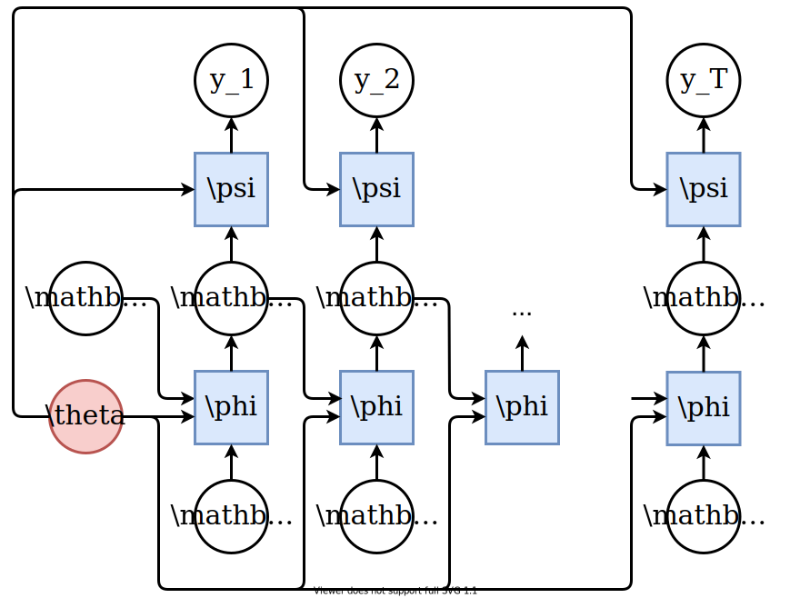]

---

class: middle

Even though the number of steps $T$ depends on $\mathbf{x}$, this is a standard computational graph, and automatic differentiation can deal with it as usual.

In the case of recurrent neural networks, this is referred to as **backpropagation through time**.

---

class: middle

.width-100[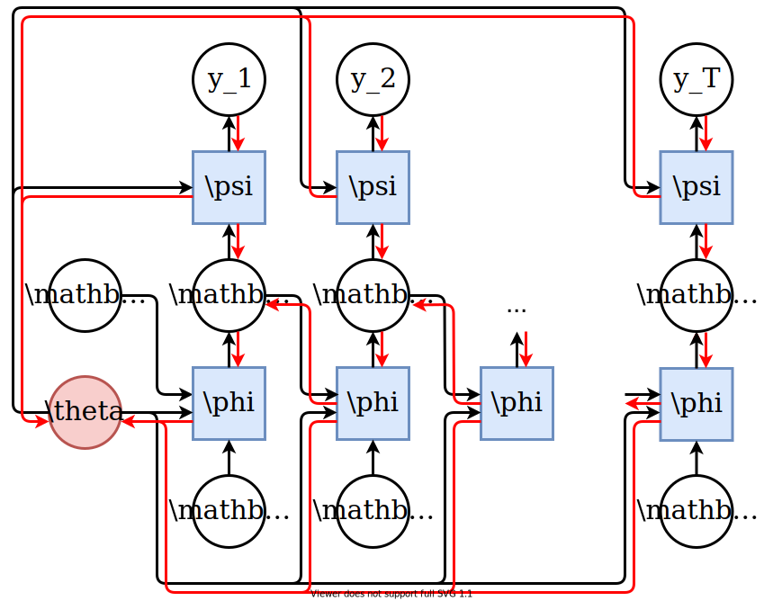]

---

# Elman networks

Elman networks consist of $\phi$ and $\psi$ defined as primitive neuron units, such as logistic regression units
$$
\begin{aligned}
\mathbf{h}\_t &= \sigma\_h\left( \mathbf{W}^T\_{xh} \mathbf{x}\_t + \mathbf{W}^T\_{hh} \mathbf{h}\_{t-1} + \mathbf{b}\_h \right) \\\\
y\_t &= \sigma\_y\left( \mathbf{W}\_y^T \mathbf{h}\_t + b\_y \right) 
\end{aligned}
$$
where $\mathbf{W}^T\_{xh} \in \mathbb{R}^{p\times q}, \mathbf{W}^T\_{hh} \in \mathbb{R}^{q\times q}, \mathbf{b}\_{h} \in \mathbb{R}^{q}, b\_{y} \in \mathbb{R}, \mathbf{h}\_0=0$, and where $\sigma\_h$ and $\sigma\_y$ are non-linear activation functions, such as the sigmoid function, $\text{tanh}$ or $\text{ReLU}$.

---

class: middle

## Benchmark example

Learn to recognize variable-length sequences that are palindromes.
For training, we use sequences of random sizes, from $1$ to $10$.

.grid[
.kol-1-4[]
.kol-1-4[
$\mathbf{x}$

$(1,2,3,2,1)$ 
$(2,1,2)$ 
$(3,4,1,2)$ 
$(0)$ 
$(1,4)$
]
.kol-1-4.center[
$y$

$1$ 
$1$ 
$0$ 
$1$ 
$0$
]
]

---

class: middle

.center.width-80[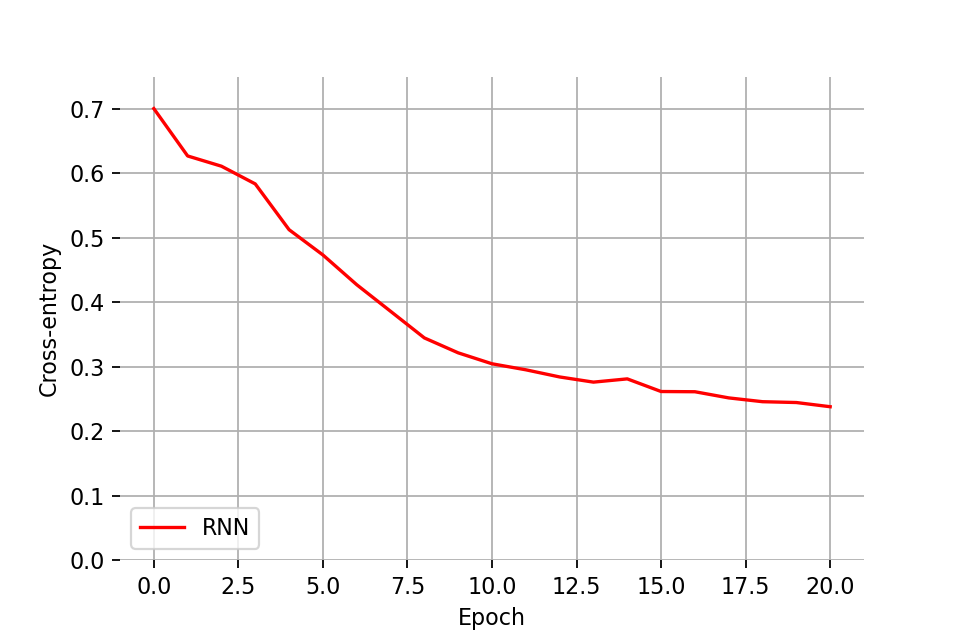]

---

# Bidirectional RNNs

Computing the recurrent states forward in time does not make use of future input values $\mathbf{x}\_{t+1:T}$, even though there are known.
- RNNs can be made **bidirectional** by consuming the sequence in both directions.
- Effectively, this amounts to run the same (single direction) RNN twice:
    - once over the original sequence $\mathbf{x}\_{1:T}$,
    - once over the reversed sequence $\mathbf{x}\_{T:1}$.
- The resulting recurrent states of the bidirectional RNN is the concatenation of two resulting sequences of recurrent states.

---

class: middle

.center.width-80[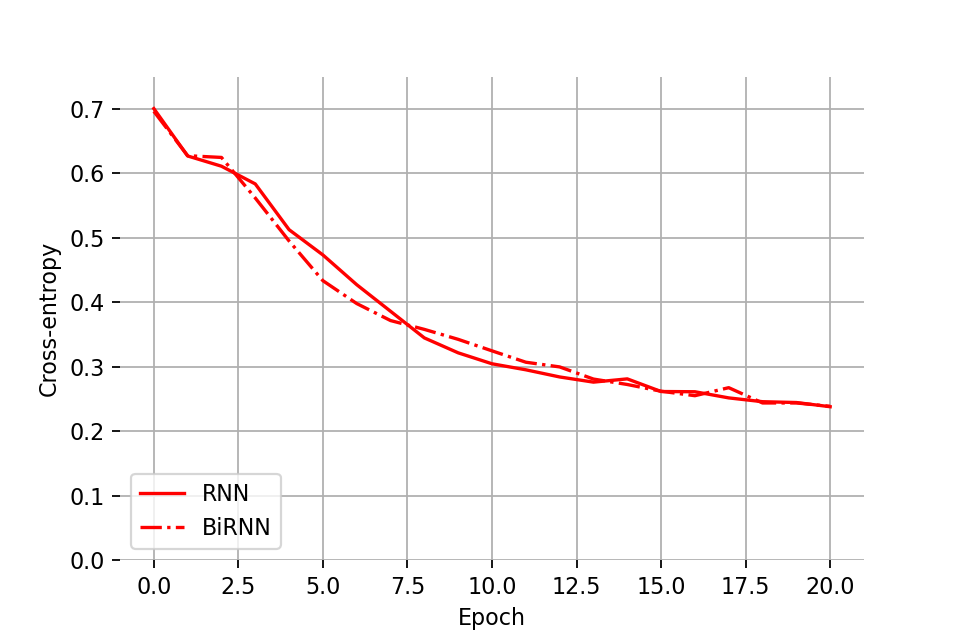]

---

# Stacked RNNs

Recurrent networks can be viewed as layers producing sequences $\mathbf{h}\_{1:T}^\ell$ of activations.

As for dense layers, recurrent layers can be composed in series to form a .bold[stack] of recurrent networks.

 

.center.width-100[]

---

class: middle

.center.width-80[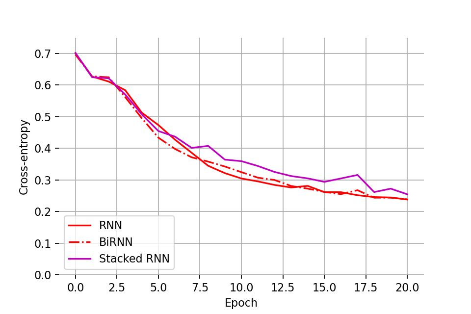]

---

# Gating

When unfolded through time, the graph of computation of a recurrent network can grow very deep, and training involves dealing with **vanishing gradients**.
- RNN cells should include a *pass-through*, or additive paths, so that the recurrent state does not go repeatedly through a squashing non-linearity.
- This is identical to skip connections in ResNet.

   
.center.width-70[]

.footnote[Credits: Francois Fleuret, [EE559 Deep Learning](https://fleuret.org/ee559/), EPFL.]

---

class: middle

For instance, the recurrent state update can be a per-component weighted average of its previous value $\mathbf{h}\_{t-1}$ and a full update $\bar{\mathbf{h}}\_t$, with the weighting $\mathbf{z}\_t$ depending on the input and the recurrent state, hence acting as a **forget gate**.

Formally,
$$
\begin{aligned}
\bar{\mathbf{h}}\_t &= \phi(\mathbf{x}\_t, \mathbf{h}\_{t-1};\theta) \\\\
\mathbf{z}\_t &= f(\mathbf{x}\_t, \mathbf{h}\_{t-1};\theta) \\\\
\mathbf{h}\_t &= \mathbf{z}\_t \odot \mathbf{h}\_{t-1} + (1-\mathbf{z}\_t) \odot \bar{\mathbf{h}}\_t.
\end{aligned}
$$

.footnote[Credits: Francois Fleuret, [EE559 Deep Learning](https://fleuret.org/ee559/), EPFL.]

---

class: middle

.center.width-80[]

---

class: middle

## LSTM

The long short-term memory model (LSTM; Hochreiter and Schmidhuber, 1997) is an instance of the previous gated recurrent cell, with the following changes:
- The recurrent state is split into two parts $\mathbf{c}\_t$ and $\mathbf{h}\_t$, where
    - $\mathbf{c}\_t$ is the cell state and
    - $\mathbf{h}\_t$ is output state.
- A forget gate $\mathbf{f}\_t$ selects the cell state information to erase.
- An input gate $\mathbf{i}\_t$ selects the cell state information to update.
- An output gate $\mathbf{o}\_t$ selects the cell state information to output.

---

  

.center.width-80[]

$$
\begin{aligned}
\mathbf{f}\_t &= \sigma\left( \mathbf{W}\_f^T \[ \mathbf{h}\_{t-1}, \mathbf{x}\_t \] + \mathbf{b}\_f \right)
\end{aligned}
$$

---

  

.center.width-80[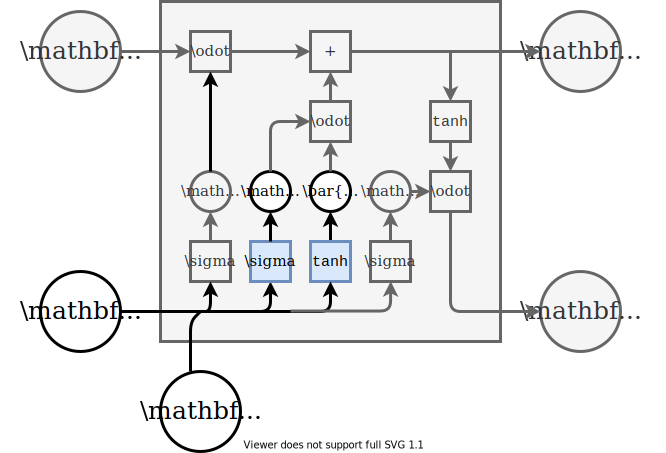]

$$
\begin{aligned}
\mathbf{i}\_t &= \sigma\left( \mathbf{W}\_i^T \[ \mathbf{h}\_{t-1}, \mathbf{x}\_t \] + \mathbf{b}\_i \right) \\\\
\bar{\mathbf{c}}\_t &= \text{tanh}\left( \mathbf{W}\_c^T \[ \mathbf{h}\_{t-1}, \mathbf{x}\_t \] + \mathbf{b}\_c \right)
\end{aligned}
$$

---

  

.center.width-80[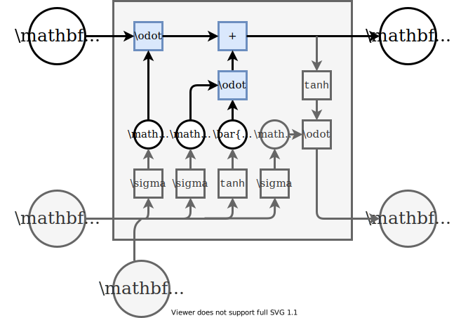]

$$
\begin{aligned}
\mathbf{c}\_t &= \mathbf{f}\_t \odot \mathbf{c}\_{t-1} + \mathbf{i}\_t \odot \bar{\mathbf{c}}\_t
\end{aligned}
$$

---

  

.center.width-80[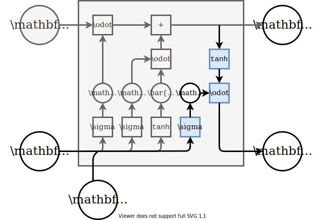]

$$
\begin{aligned}
\mathbf{o}\_t &= \sigma\left( \mathbf{W}\_o^T \[ \mathbf{h}\_{t-1}, \mathbf{x}\_t \] + \mathbf{b}\_o \right) \\\\
\mathbf{h}\_t &= \mathbf{o}\_t \odot \text{tanh}(\mathbf{c}\_{t})
\end{aligned}
$$

---

class: middle

.center.width-80[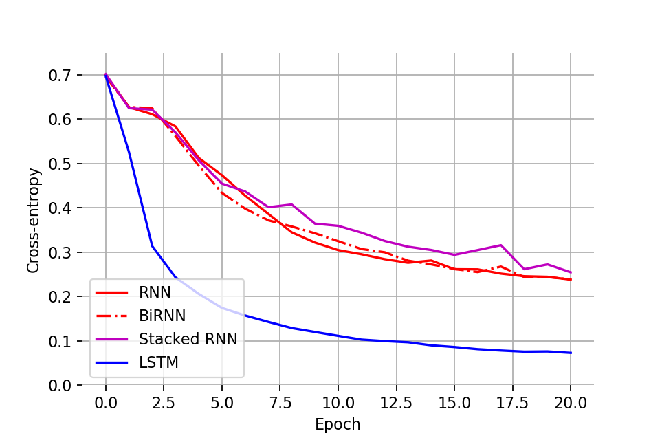]

---

class: middle

## GRU

The gated recurrent unit (GRU; Cho et al, 2014) is another gated recurrent cell.
- It uses two gates instead of three: an update gate $\mathbf{z}\_t$ and a reset gate $\mathbf{r}\_t$.
- GRUs perform similarly as LSTMs for language or speech modeling sequences, but with fewer parameters.
- However, LSTMs remain strictly stronger than GRUs.

---

class: middle

.center.width-70[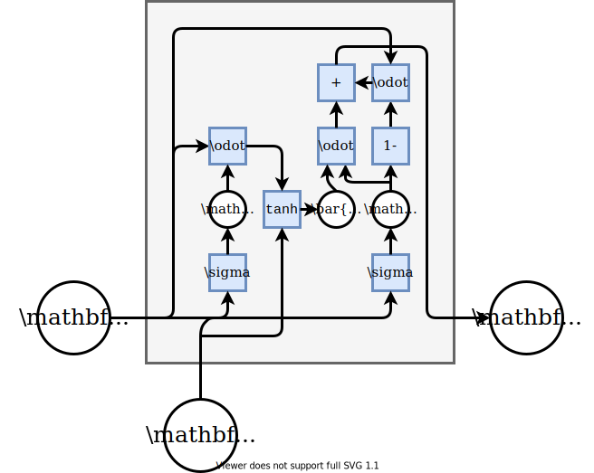]

$$
\begin{aligned}
\mathbf{z}\_t &= \sigma\left( \mathbf{W}\_z^T  \[ \mathbf{h}\_{t-1}, \mathbf{x}\_t \] + \mathbf{b}\_z \right) \\\\
\mathbf{r}\_t &= \sigma\left( \mathbf{W}\_r^T  \[ \mathbf{h}\_{t-1}, \mathbf{x}\_t \] + \mathbf{b}\_r \right) \\\\
\bar{\mathbf{h}}\_t &= \text{tanh}\left( \mathbf{W}\_h^T  \[ \mathbf{r}\_t \odot \mathbf{h}\_{t-1}, \mathbf{x}\_t \] + \mathbf{b}\_h \right) \\\\
\mathbf{h}\_t &= (1-\mathbf{z}\_t) \odot \mathbf{h}\_{t-1} + \mathbf{z}\_t \odot \bar{\mathbf{h}}\_t
\end{aligned}
$$

---

class: middle

.center.width-80[]

---

class: middle

.center.width-80[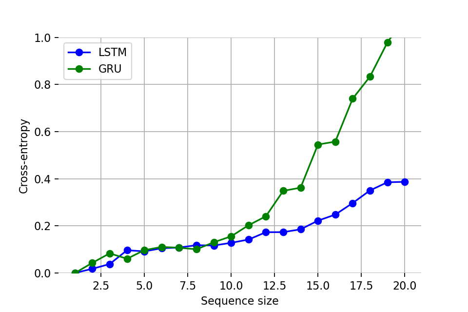]

.center[The models do not generalize to sequences longer than those in the training set!]

---

class: middle, center

(demo)

---

# Exploding gradients

Gated units prevent gradients from vanishing, but not from **exploding**.

 
.center.width-95[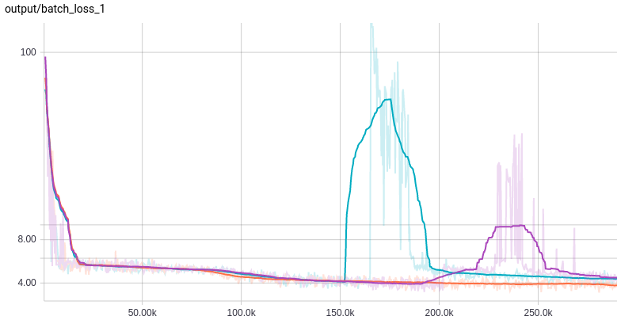]

.footnote[Credits: [pat-coady](https://pat-coady.github.io/rnn/).]

---

class: middle

.center.width-60[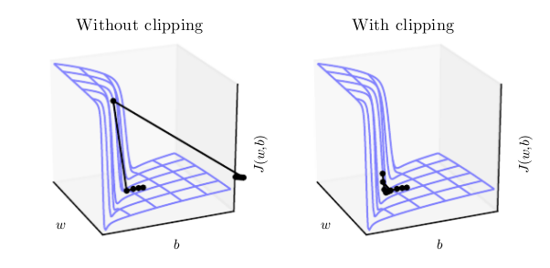]

The standard strategy to solve this issue is *gradient norm clipping*, which rescales the norm of the gradient to a fixed threshold $\delta$ when it is above:
$$\tilde{\nabla} f = \frac{\nabla f}{||\nabla f||} \min(||\nabla f||, \delta).$$

.footnote[Credits: Francois Fleuret, [EE559 Deep Learning](https://fleuret.org/ee559/), EPFL.]

---

# Orthogonal initialization

Let us consider a simplified RNN, with no inputs, no bias, an identity activation function $\sigma$ (as in the positive part of a ReLU) and the initial recurrent state $\mathbf{h}\_0$ set to the identity matrix.

We have,
$$
\begin{aligned}
\mathbf{h}\_t &= \sigma\left( \mathbf{W}^T\_{xh} \mathbf{x}\_t + \mathbf{W}^T\_{hh} \mathbf{h}\_{t-1} + \mathbf{b}\_h \right) \\\\
&= \mathbf{W}^T\_{hh} \mathbf{h}\_{t-1} \\\\
&= \mathbf{W}^T \mathbf{h}\_{t-1}.
\end{aligned}
$$

For a sequence of size $n$, it comes
$$\mathbf{h}\_n = \mathbf{W}(\mathbf{W}(\mathbf{W}(...(\mathbf{W}\mathbf{h}\_0)...))) = \mathbf{W}^n\mathbf{h}\_0 = \mathbf{W}^n I = \mathbf{W}^n.$$

Ideally, we would like $\mathbf{W}^n$ to neither vanish nor explode as $n$ increases.

???

Do on the iPad

---

class: middle

## Fibonacci digression

The Fibonacci sequence is
$$0, 1, 1, 2, 3, 5, 8, 13, 21, 34, 55, 89, 144, 233, 377, ...$$
It grows fast! But how fast?

---

class: middle

In matrix form, the Fibonacci sequence is equivalently expressed as

$$
\begin{pmatrix}
f\_{k+2} \\\\
f\_{k+1}
\end{pmatrix} =
\begin{pmatrix}
1 & 1 \\\\
1 & 0
\end{pmatrix}\begin{pmatrix}
f\_{k+1} \\\\
f\_{k}
\end{pmatrix}.
$$

With $\mathbf{f}\_0 = \begin{pmatrix}
1 \\\\
0
\end{pmatrix}$, we have
$$\mathbf{f}\_{k+1} = \mathbf{A} \mathbf{f}\_{k} = \mathbf{A}^{k+1} \mathbf{f}\_{0}.$$

---

class: middle

The matrix $\mathbf{A}$ can be diagonalized as
$$\mathbf{A} = \mathbf{S} \Lambda \mathbf{S}^{-1},$$
where
$$
\begin{aligned}
\Lambda &= \begin{pmatrix}
\varphi & 0 \\\\
0 & -\varphi^{-1}
\end{pmatrix}\\\\
\mathbf{S} &= \begin{pmatrix}
\varphi & -\varphi^{-1} \\\\
1 & 1
\end{pmatrix}
\end{aligned}.
$$

In particular,
$$\mathbf{A}^n = \mathbf{S} \Lambda^n \mathbf{S}^{-1}.$$

Therefore, the Fibonacci sequence grows **exponentially fast** with the golden ratio $\varphi$.

---

class: middle

## Theorem

Let $\rho(\mathbf{A})$ be the spectral radius of the matrix $\mathbf{A}$, defined as
$$\rho(\mathbf{A}) = \max\\\{ |\lambda\_1|,...,|\lambda\_d| \\\}.$$

We have:
- if $\rho(\mathbf{A}) < 1$ then $\lim\_{n\to\infty} ||\mathbf{A}^n|| = \mathbf{0}$ (= vanishing activations),
- if $\rho(\mathbf{A}) > 1$ then $\lim\_{n\to\infty} ||\mathbf{A}^n|| = \infty$ (= exploding activations).

---

class: middle

.center[
<video loop controls preload="auto" height="400" width="600">
  <source src="./figures/lec7/eigenvalue_vanish.m4v" type="video/mp4">
</video>

$\rho(\mathbf{A}) < 1$, $\mathbf{A}^n$ vanish.
]

.footnote[Credits: Stephen Merety, [Explaining and illustrating orthogonal initialization for recurrent neural networks](https://smerity.com/articles/2016/orthogonal_init.html), 2016.]

---

class: middle

.center[
<video loop controls preload="auto" height="400" width="600">
  <source src="./figures/lec7/eigenvalue_explode.m4v" type="video/mp4">
</video>

$\rho(\mathbf{A}) > 1$, $\mathbf{A}^n$ explode.
]

.footnote[Credits: Stephen Merety, [Explaining and illustrating orthogonal initialization for recurrent neural networks](https://smerity.com/articles/2016/orthogonal_init.html), 2016.]

---

class: middle

## Orthogonal initialization

If $\mathbf{A}$ is orthogonal, then it is diagonalizable and all its eigenvalues are equal to $-1$ or $1$. In this case, the norm of
$$\mathbf{A}^n = \mathbf{S} \Lambda^n \mathbf{S}^{-1}$$
remains bounded.

- Therefore, initializing $\mathbf{W}$ as a random orthogonal matrix will guarantee that activations will neither vanish nor explode.
- In practice, a random orthogonal matrix can be found through the SVD decomposition or the QR factorization of a random matrix.
- This initialization strategy is known as **orthogonal initialization**.

---

class: middle

.center[
<video loop controls preload="auto" height="400" width="600">
  <source src="./figures/lec7/eigenvalue_orthogonal.m4v" type="video/mp4">
</video>

$\mathbf{A}$ is orthogonal.
]

.footnote[Credits: Stephen Merety, [Explaining and illustrating orthogonal initialization for recurrent neural networks](https://smerity.com/articles/2016/orthogonal_init.html), 2016.]

---

class: middle

Exploding activations are also the reason why squashing non-linearity functions (such as $\text{tanh}$ or sigmoids) are preferred in RNNs, since they avoid recurrent states from exploding by upper bounding $||\mathbf{h}\_t||$.

(At least when running the network forward.)

???

https://github.com/nyu-dl/NLP_DL_Lecture_Note/blob/master/lecture_note.pdf

---

class:  middle

# Applications

(some)

---

class: middle

## Sentiment analysis

.center[
.width-100[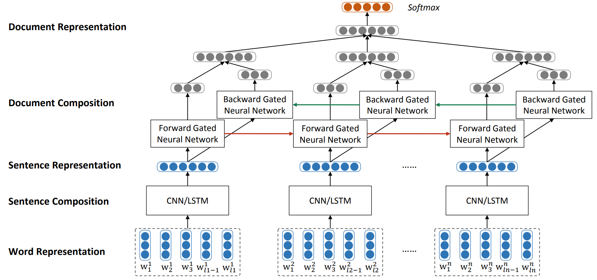]

Document-level modeling for sentiment analysis (= text classification),  with stacked, bidirectional and gated recurrent networks.
]

.footnote[Credits: Duyu Tang et al, [Document Modeling with Gated Recurrent Neural Network for Sentiment Classification](http://www.aclweb.org/anthology/D15-1167), 2015.]

---

class: middle

## Language models

Language models model language as a Markov chain, in which sentences are sequences of words $\mathbf{w}\_{1:T}$ drawn repeatedly from
$p(\mathbf{w}\_t | \mathbf{w}\_{1:t-1}).$

This is an instance of sequence synthesis, for which predictions are computed at all time steps $t$.
.center[
.width-60[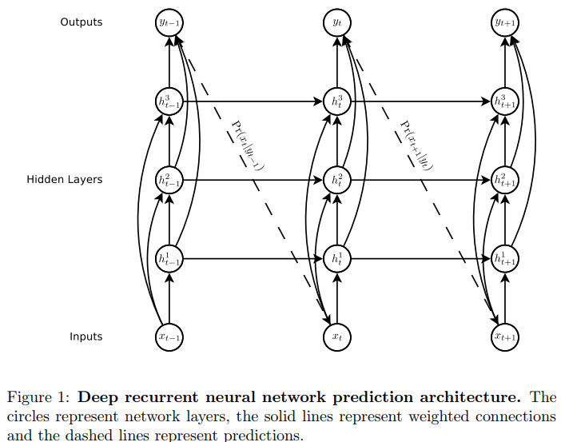]
]

.footnote[Credits: Alex Graves, [Generating Sequences With Recurrent Neural Networks](https://arxiv.org/abs/1308.0850), 2013.]

---

class: middle

.center[
.width-80[]
]

.footnote[Credits: [Max Woolf](https://drive.google.com/file/d/1mMKGnVxirJnqDViH7BDJxFqWrsXlPSoK/view?usp=sharing), 2018.]

---

class: middle

## Sequence synthesis

The same generative architecture applies to any kind of sequences.
E.g., [`sketch-rnn-demo`](https://magenta.tensorflow.org/assets/sketch_rnn_demo/index.html) for sketches defined as sequences of strokes.

.center.width-80[]

---

class: middle

## Neural machine translation

.center[
.width-100[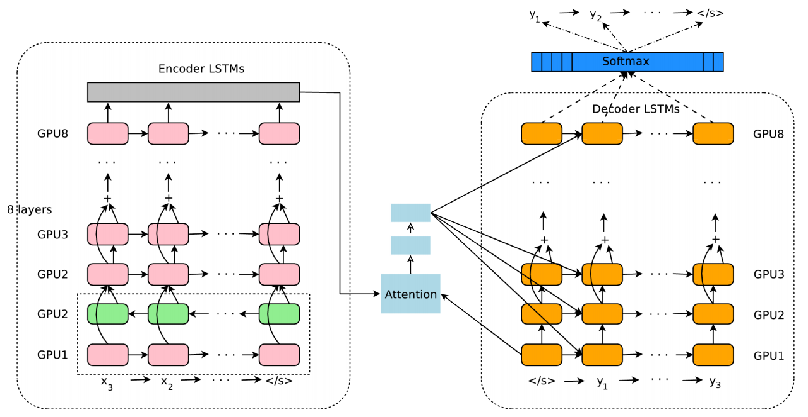]
]

.footnote[Credits: Yonghui Wu et al, [Google’s Neural Machine Translation System: Bridging the Gap between Human and Machine Translation](https://arxiv.org/abs/1609.08144), 2016.]

---

class: middle

.center[
.width-100[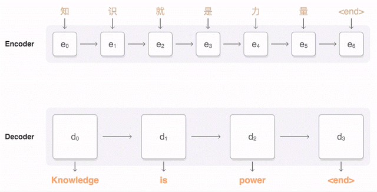]
]

.footnote[Credits: Yonghui Wu et al, [Google’s Neural Machine Translation System: Bridging the Gap between Human and Machine Translation](https://arxiv.org/abs/1609.08144), 2016.]

---

class: middle

## Text-to-speech synthesis

.width-80.center[]

.footnote[Image credits: [Shen et al, 2017. arXiv:1712.05884](https://arxiv.org/abs/1712.05884).]

---

class: middle, black-slide

.center[
<iframe width="640" height="400" src="https://www.youtube.com/embed/Ipi40cb_RsI?&loop=1&start=0" frameborder="0" volume="0" allowfullscreen></iframe>
]

## Learning to control 

A recurrent network playing Mario Kart.

---

class: middle

# Beyond sequences 

---

class: middle

.center.circle.width-30[]

.italic[
An increasingly large number of .bold[people are defining the networks procedurally in a data-dependent way (with loops and conditionals)], allowing them to change dynamically as a function of the input data fed to them. It's really .bold[very much like a regular program, except it's parameterized].
]

.pull-right[Yann LeCun (Director of AI Research, Facebook, 2018)]

---

# Programs as neural nets

The topology of a recurrent network unrolled through time is not fixed, but **dynamic**. 
It depends on:
- the input sequence and its size
- a graph construction algorithms which consumes input tokens in sequence to add layers to the graph of computation.

---

class: middle

This principle generalizes to:
- arbitrarily structured data (e.g., sequences, trees, **graphs**)
- arbitrary graph of computation construction algorithm that traverses these structures (e.g., including for-loops or recursive calls).

---

class: middle

## Neural message passing

.center[
.width-50[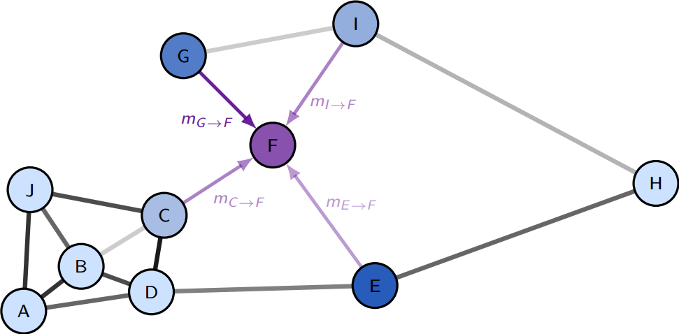] .width-60[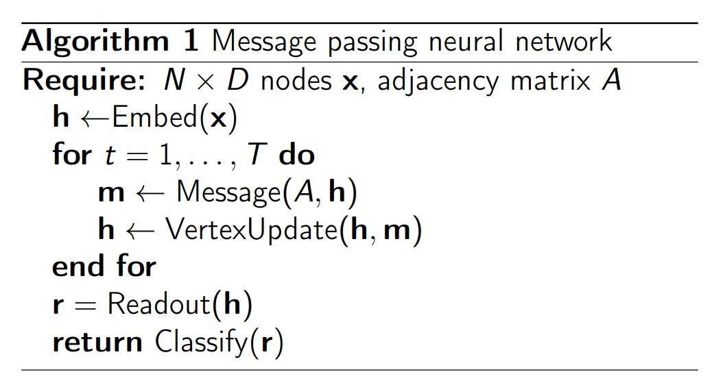]
]

Even though the graph topology is dynamic, the unrolled computation is fully differentiable. The program is trainable.

.footnote[Credits: [Henrion et al](https://dl4physicalsciences.github.io/files/nips_dlps_2017_29.pdf), 2017.]

---

class: middle

## Graph neural network for object detection in point clouds

.center.width-100[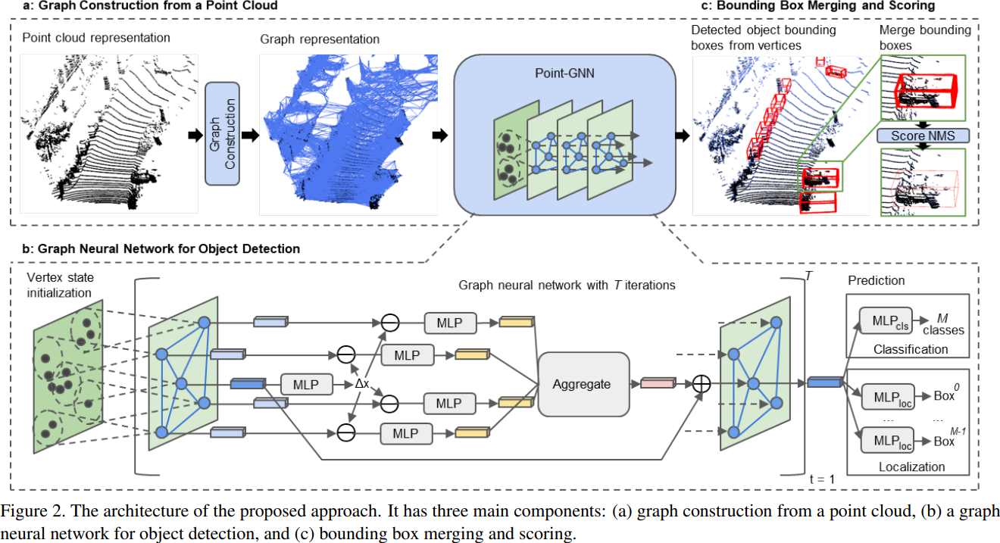] 

.footnote[Credits: Shi and Rajkumar, [Point-GNN](https://arxiv.org/abs/2003.01251), 2020.]

---

class: middle 

## Quantum chemistry with graph networks

.center.width-65[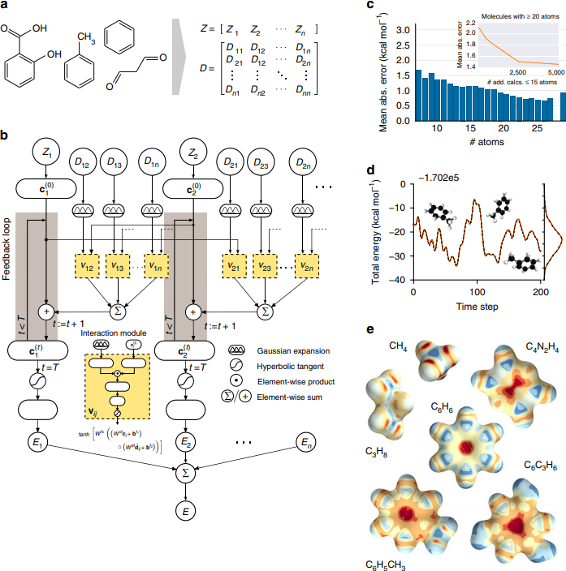] 

.footnote[Credits: [Schutt et al](https://www.nature.com/articles/ncomms13890), 2017.]

???

quantum-mechanical properties of molecular systems

---

class: middle 

## Learning to simulate physics with graph networks

.center.width-100[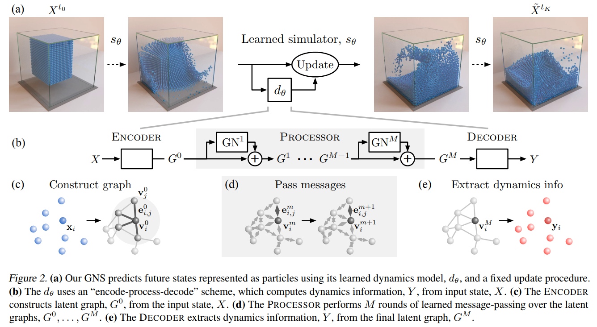] 

.footnote[Credits: [Sanchez-Gonzalez et al](https://arxiv.org/abs/2002.09405), 2020.]

---

class: middle, black-slide

.center[
<video loop controls preload="auto" height="400" width="600">
  <source src="./figures/lec7/physics-simulation.mp4" type="video/mp4">
</video>
]

.footnote[Credits: [Sanchez-Gonzalez et al](https://arxiv.org/abs/2002.09405), 2020.]

---

# Neural computers

.center.width-55[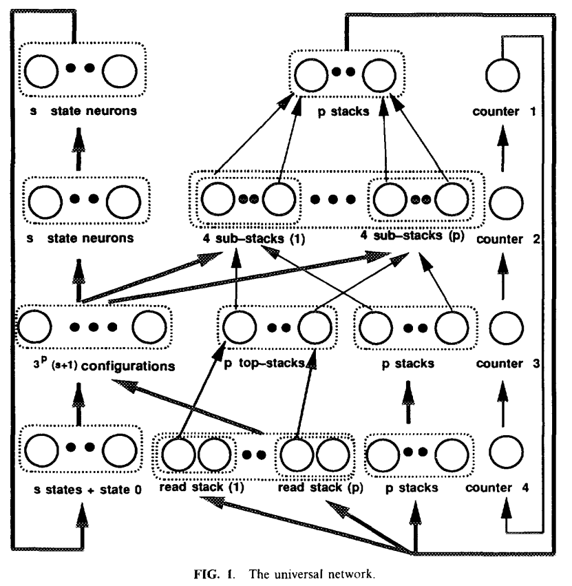]

.center[Any Turing machine can be simulated by a recurrent neural network 
(Siegelmann and Sontag, 1995)]

???

This implies that usual programs can all be equivalently implemented as a neural network, in theory.

---

class: middle

.center.width-80[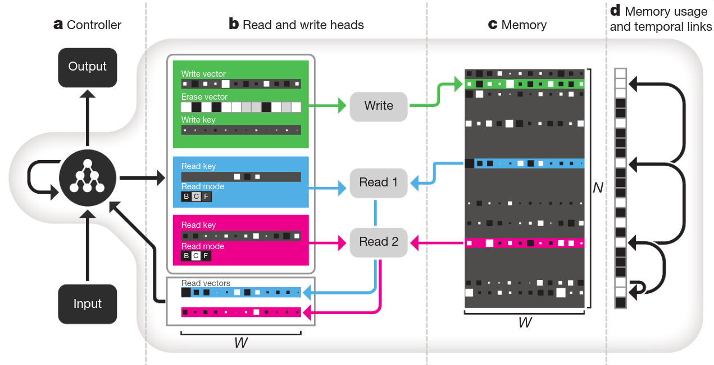]

Networks can be coupled with memory storage to produce **neural computers**: 
- The controller processes the input sequence and interacts with the memory to generate the output. 
- The read and write operations *attend to* all the memory addresses.

???

- A Turing machine is not very practical to implement useful programs.
- However, we can simulate the general architecture of a computer in a neural network.

---

class: middle

.width-100[]

A differentiable neural computer being trained to store and recall dense binary numbers.
Upper left: the input (red) and target (blue), as 5-bit words and a 1 bit interrupt signal.
Upper right: the model's output

---

class: end-slide, center
count: false

The end.